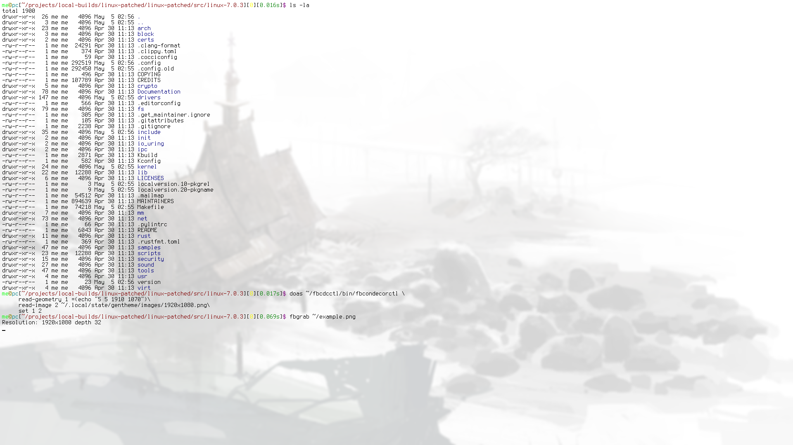

# Fbcondecor

The framebuffer console decorations patch, reworked and updated to newer
kernel versions.

> [!NOTE]
> This is a complete overhaul of the interface of the original patch.
> This means that **the way you use this version of the patch
> is different from the way you would use any other version** and your
> fbsplash themes **will not work**, as the ioctls that fbsplash uses to
> communicate **will fail**. Hence, you cannot just grab this patch and expect
> it to work with your existing setup, if you have one. You will have to do
> more work to set up this version of the patch. This version is a lot easier
> to set up than the other versions, however. See below for more information.

> [!WARNING]
> You are using this patch at your own risk. Keep in mind that I am not a
> kernel developer. I cannot guarantee that my modifications to the patch
> (nor the original patch, for that matter) are secure, stable, or performant.
> The kernel has not crashed **on my machine** and runs fine, performance-wise,
> but I do not give any guarantees that it will function identically on your
> machine. Do with that information as you wish.

## History

From what I can gather (the information is sparse, so I will be concise):

This concept has origins in the bootsplash project by the following people,
Volker Poplawski,
Stefan Reinauer,
Steffen Winterfeldt,
Michael Schroeder,
Ken Wimer.

Later, Michal Januszewski (spock), created fbcondecor to supersede that
project.

This patch was used by Gentoo Linux to provide eye-candy during bootup, using
splashutils/fbsplash. The patch also allowed background images in the TTY
**after** bootup.

## Status

Fbsplash is not maintained anymore, neither is the fbcondecor patch. Some
people *have* attempted to update the patch to newer kernel versions, without
changing it much in the process, but they seem to have all given up eventually.
People generally use Plymouth to do boot splashes now. One issue is that, even
though Plymouth exists, background images in the TTY are not in its scope; they
still require a kernel patch that modifies the framebuffer console.

## This patch

While most people probably don't care, given that they will use a graphical
environment with some sort of login manager anyway, I wanted to see if I could
get the patch working on latest kernel versions. In the process, I trimmed and
simplified a lot of the code. The patch works on my machine (I use Intel
integrated graphics, with the i915 driver), but I have **not** tested it
anywhere else, so you should keep that in mind.

The following was changed (overview, not exhaustive):
- the userspace helper that the kernel calls was entirely removed
- you communicate with the kernel using a single ioctl now
- the background image is stored per vc, rather than per-framebuffer
  - this has the benefit of the kernel not needing to call a userspace
    helper each time you switch to a different tty
  - it also has the drawback of increased memory usage: every vc may
    hold an image; on a full HD display, this means that,
    ~8.3MiB*MAX_NR_CONSOLES (63 as of time of writing this) = 523 MiB of
    memory could theoretically be used just for background images, if you
    choose to set an image on all consoles (realistically, you would not be
    doing this, though, the memory for an image is only allocated if an image
    is actually set on the vc)
- only 32bpp True Color framebuffers are supported, I intentionally trimmed all
  of the code that attempted to support other types of framebuffers to reduce
  the size of the patch and the amount of things that could go wrong; on a
  modern machine, you *probably* will be using 32bpp True Color anyway, so you
  should not be affected
- you have the ability to retrieve images/geometries from consoles, in addition
  to setting them

## Usage

Since the patch was redesigned, fbsplash/splashutils no longer works to
control console decorations. I have, instead, written a different userspace
tool, with a much smaller codebase, called
[fbcondecorctl](https://github.com/nytelytee/fbcondecorctl). You may use it as
a reference implementation if you need to implement your own controller for
whatever reason, but it is fairly capable on its own.

## Example images

## Thanks

Huge thanks to the original creators of the bootsplash project, and to spock
for making the original version of this patch, thus making this modification
possible.
